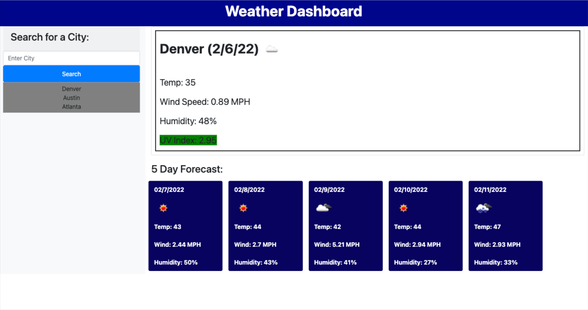

Homework #6 Weather Dashboard

The app can be found here - https://mtnbiker72.github.io/weather-dashboard/

Build a weather dashboard that allows a user to input a city name and get various weather data.  These include:
  * User is presented with city name, current date, an icon representation of weather conditions, them temp, the humidity,
  the wind speed and UV index for today's weather
  * The displayed value of the UV index will have a background of green, orange, or red depending on if the conditions 
  are favorable, moderate, or severe
  * The 5 day forecast is displayed including date, weather incon, temp, wind, and humidity
  * Cities are stored in local storage so the user doesn't have to re-type in favorite Cities
  * No duplicate cities are added

